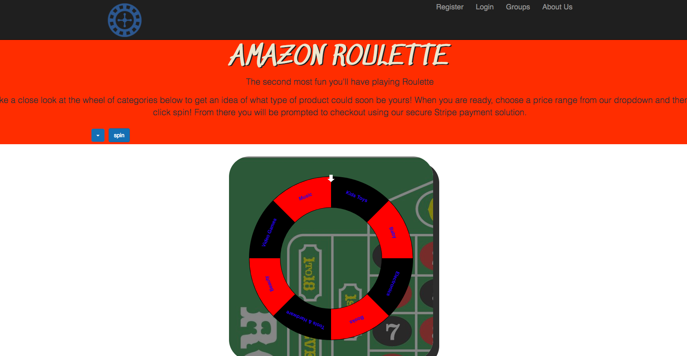
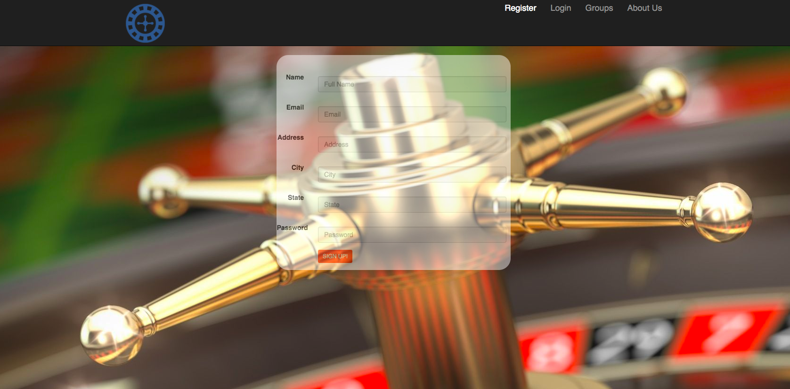
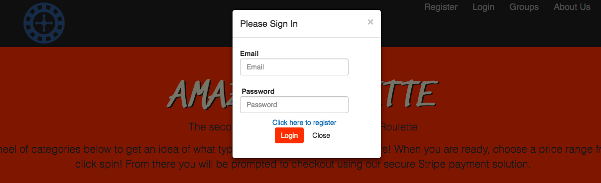
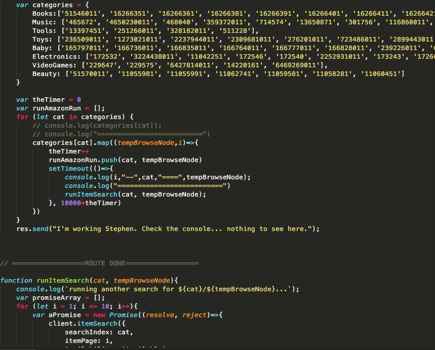
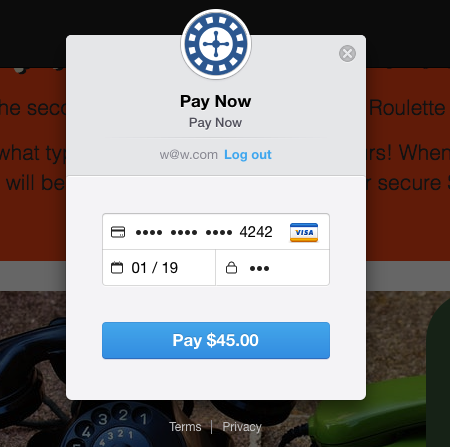

# Amazon Roulette
___

## What It Is
One-spin Amazon Product selector generated on a user-selected price range.  Land on a category, and immediately check out for the product that is returned from Amazon's API that falls into that price range.  Continue to spin and return products from various price ranges.  Categories include: Baby, Beauty, Books, Electronics, Music, Tools & Hardware, Kids Toys, and Video Games.  

## Team Members
* [Shane Hall](https://github.com/cshall13)
* [Stephen Ward](https://github.com/stephenward21)

## Languages and Technologies Used
* HTML
* CSS
* React Bootstrap
* JavaScript
* jQuery
* Node.js (Express - back end API)
* ReactJS 
* MySQL
* Ajax
* Bcrypt (node module, used to store encrypted passwords into the database)
* Stripe (Credit Card Processor)

## Dependencies and Plugins
* express
* bcrypt
* MySQL
* amazon-affiliate-api
* rand-token
* Stripe

## APIs used
* Amazon Product Affiliate 

## Site Walkthrough

### Landing/Home Pages

Outside of detailed user information pages (login, register, group, etc), the user is mainly focused on the Home Page.  This is where he/she can select a price from a dropdown, and take a spin.  The Home Page component is where we import our other components/containers, and handles a majority of the rendering you see throughout the application.

### Register

Creating an Account is dynamic and must be completed before a user can successfully spin and receive a product.  We store registration info in our database.  

### Login

Instead of having the user direct to a separate page for the login, we have a bootstrap modal that populates on click in the navbar.  Track user session with a token generated through bcrypt.

## Amazon Database Product Injection

We decided to select numerous Amazon BrowseNodes in each applicable product category, and from there wrote a sequel injection script to run through each BrowseNode, select all the products, and insert into the database.

## Stripe Checkout

Once the wheel has finished spinning and a product has been chosen from the selected category, the user will be given the options to check out or spin again.  On click of the check out button, the Stripe check out modal will be show.

## Challenges

Amazon's Product API is massive... It took considerable time and experimentation to determine how we wanted to ingest and organize the product data.  We decided to utilize an Amazon product node module to efficiently make the API calls to Amazon, mainly utilizing the BrowseNode ID's and the searchIndex (i.e. Books, Music, Baby, etc.)

Making the wheel functional and communicating with front and back ends.  Pulling the category data and organizing the Ajax calls and getJSON to return the necessary data to ultimately populate into Stripes checkout payment method. 